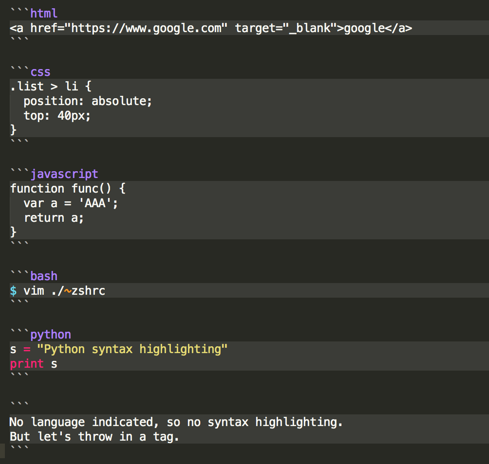

# Markdown
> 출처 : https://heropy.blog/2017/09/30/markdown/<br>
> 본 문서는 Github Markdown을 기준으로 작성되었습니다.

## 마크다운의 장점
1. 문법이 쉽다.
2. 관리가 쉽다.
3. 지원 가능한 플랫폼과 프로그램이 다양하다.

## 마크다운의 단점
1. 표준이 없다.(사용자마다 문법이 다를 수 있다.)
2. 모든 HTML 마크업을 대체할 수 없다.

## 마크다운의 사용
메모장, 에디터 등 다양한 곳에서 사용할 수 있다.<br>
코드 하일라이 효과를 원한다면 전용 에디터를 사용하는 것이 좋다.<br>
화면에 표현되는 스타일은 각 플랫폼의 설정에 따라 달라진다.

## 마크다운의 문법

### 제목(Header)
`h1`부터 `h6`까지 표현할 수 있다.<br>

-*문법*-

```Markdown
# 제목1
## 제목2
### 제목3
#### 제목4
##### 제목5
###### 제목6
```
-*결과*-

# 제목1
## 제목2
### 제목3
#### 제목4
##### 제목5
###### 제목6
<br>
제목1(h1)과 제목2(h2)는 다음과 같게도 표현할 수 있다.

```Markdown
제목 1
======

제목 2
------
```
제목 1
======
제목 2
------

## 강조(Emphasis)
각각 `<em>`, `<strong>`, `<del>` 태그로 변환된다.<br>
밑줄을 사용하고 싶다면 `<u></u>` 태그를 사용한다.<br>

-*문법*-

```
이탤릭체는 *별표(asterisks)* 혹은 _언더바(underscore)_를 사용한다. --> <em>
두껍게는 **별표 두개** 혹은 __언더바 두개__를 사용한다. --> <strong>
**_이텔릭체_와 두껍게**를 같이 사용할 수 있다.
취소선은 ~~물결표시(tilde)~~를 사용한다. --> <del>
<u>밑줄</u>은 `<u></u>`를 사용한다.
```
-*결과*-<br>

이탤릭체는 *별표(asterisks)* 혹은 _언더바(underscore)_를 사용한다.<br>
두껍게는 **별표 두개** 혹은 __언더바 두개__를 사용한다.<br>
**_이텔릭체_와 두껍게**를 같이 사용할 수 있다.<br>
취소선은 ~~물결표시(tilde)~~를 사용한다.<br>
<u>밑줄</u>은 `<u></u>`를 사용한다.

## 목록
`<ol>`, `<ul>` 목록 태그로 변환된다.

-*문법*-

```Markdown
1. 순서가 필요한 목록
1. 순서가 필요한 목록
  - 순서가 필요하지 않은 목록(서브)
  - 순서가 필요하지 않은 목록(서브)
1. 순서가 필요한 목록
    1. 순서가 필요한 목록(서브)
    1. 순서가 필요한 목록(서브)
1. 순서가 필요한 목록

- 순서가 필요하지 않은 목록에 사용 가능한 기호
  - 대쉬(hyphen)
  * 별표(asterisks)
  + 더하기(plus sign)
```

-*결과*-<br>

1. 순서가 필요한 목록
1. 순서가 필요한 목록
  - 순서가 필요하지 않은 목록(서브)
  - 순서가 필요하지 않은 목록(서브)
1. 순서가 필요한 목록
    1. 순서가 필요한 목록(서브)(앞에 tab이 두 번)
    1. 순서가 필요한 목록(서브)(앞에 tab이 두 번)
1. 순서가 필요한 목록

- 순서가 필요하지 않은 목록에 사용 가능한 기호
  - 대쉬(hyphen)
  * 별표(asterisks)
  + 더하기(plus sign)

## 링크(Links)
`<a>`로 변환된다.<br>

-*문법*-

```Markdown
[GOOGLE](https://google.com)
[NAVER](https://naver.com "링크 설명(title)을 작성")
[상대적 참조](../users/login)
[Dribbble][Dribbble link]
[Github][1]

문서 안에서 [참조 링크]를 그대로 사용할 수도 있다.

다음과 같이 문서 내 일반 URL이나 꺽쇠 괄호(`<>`, Angle Brackets)안의 URL은 자동으로 링크를 사용한다.
구글 홈페이지: https://google.com
네이버 홈페이지: <https://naver.com>

[Dribbble link]: https://dribbble.com
[1]: https://github.com
[참조 링크]: https://naver.com "네이버로 이동합니다!"
```

-*결과*-<br>

[GOOGLE](https://google.com)<br>
[NAVER](https://naver.com "링크 설명(title)을 작성")<br>
[상대적 참조](../users/login)<br>
[Dribbble][Dribbble link]<br>
[Github][1]

문서 안에서 [참조 링크]를 그대로 사용할 수도 있다.

다음과 같이 문서 내 일반 URL이나 꺽쇠 괄호(`<>`, Angle Brackets)안의 URL은 자동으로 링크를 사용한다.<br>
구글 홈페이지: https://google.com<br>
네이버 홈페이지: <https://naver.com>

[Dribbble link]: https://dribbble.com
[1]: https://github.com
[참조 링크]: https://naver.com "네이버로 이동합니다!"

## 이미지(images)
``로 변환된다.<br>
링크와 비슷하지만 앞에 !가 붙는다.<br>

-*문법*-

```Markdown
을 입력")

![water][logo]

[logo]: https://images.pexels.com/photos/325807/pexels-photo-325807.jpeg?auto=compress&cs=tinysrgb&dpr=2&h=750&w=1260 "water"
```
-*결과*-<br>

을 입력")

![water][logo]

[logo]: https://images.pexels.com/photos/325807/pexels-photo-325807.jpeg?auto=compress&cs=tinysrgb&dpr=2&h=750&w=1260 "water"

## 이미지에 링크
마크다운 이미지 코드를 링크 코드로 묶어준다.

```Markdown
[ ](https://naver.com)
```

[ ](https://naver.com)

## 코드 강조
`<pre>`, `<code>`로 변환된다.<br>
숫자 1번 키 왼쪽에 있는 `(grave)를 입력한다.

## 인라인(inline) 코드 강조
-*문법*-

```Markdown
`background` 혹은 `background-image` 속성으로 요소에 배경 이미지를 삽입한다.
```

-*결과*-<br>
`background` 혹은 `background-image` 속성으로 요소에 배경 이미지를 삽입한다.

## 블록(block) 코드 강조
`를 3번 이상 입력하고 코드 종류도 적는다.<br>

-*문법*-



-*결과*-

```html
<a href="https://www.google.com" target="_blank">google</a>
```

```css
.list > li {
  position: absolute;
  top: 40px;
}
```

```javascript
function func() {
  var a = 'AAA';
  return a;
}
```

```bash
$ vim ./~zshrc
```

```python
s = "Python syntax highlighting"
print s
```

```
No language indicated, so no syntax highlighting.
But let's throw in a tag.
```
## 표(table)
`<table>` 태그로 변환된다.<br>
헤더 셀을 구분할 때 3개 이상의 `-`(hyphen/dash) 기호가 필요하다.<br>
헤더 셀을 구분하면서 `:`(colons) 기호로 셀 안의 내용을 정렬할 수 있다.(:--- 왼쪽 이면 좌측 정렬 / :---: 양쪽으로 쓰면 양쪽 정렬 / ---: 우측에 쓰면 우측 정렬)<br>
가장 좌측과 가장 우측에 있는 `|`(vertical bar)는 생략이 가능하다.<br>

-*문법*-

```Markdown
| Header One     | Header Two     | Header Three   |
| :------------- | :------------: | -------------: |
| Item One       | Item Two       | Item Two       |

Header One     | Header Two     | Header Three
:------------- | :------------: | -------------:
Item One       | Item Two       | Item Two
Item four      | Item five      |
```

-*결과*-

| Header One     | Header Two     | Header Three   |
| :------------- | :------------: | -------------: |
| Item One       | Item Two       | Item Two       |

Header One     | Header Two     | Header Three
:------------- | :------------: | -------------:
Item One       | Item Two       | Item Two
Item four      | Item five      |

## 인용문(Blockqute)
`<blockqute>` 태그로 변환된다.

-*문법*-

```Markdown
인용문(blockqute)
> 남의 말이나 글에서 직접 또는 간접으로 따온 문장.<br>
> _(네이버 국어 사전)_

BREAK!

> 인용문을 작성하세요.!
>> 중첩된 인용문(nested blockqute)을 만들 수 있습니다.
>>> 중중첩된 인용문 1<br>
>>> 중중첩된 인용문 2<br>
>>> 중중첩된 인용문 3
```

-*결과*-<br>

인용문(blockqute)
> 남의 말이나 글에서 직접 또는 간접으로 따온 문장.<br>
> _(네이버 국어 사전)_

BREAK!

> 인용문을 작성하세요.!
>> 중첩된 인용문(nested blockqute)을 만들 수 있습니다.
>>> 중중첩된 인용문 1<br>
>>> 중중첩된 인용문 2<br>
>>> 중중첩된 인용문 3

## 원시 HTML(Raw HTML)
마크다운 문법이 아닌 원시 HTML 문법을 사용할 수 있다.

-*문법*-

```Markdown
<u>마크다운에서 지원하지 않는 기능</u>을 사용할 때 유용하며 대부분 잘 동작한다.


```

-*결과*-<br>

<u>마크다운에서 지원하지 않는 기능</u>을 사용할 때 유용하며 대부분 잘 동작한다.<br>

<br>


## 수평선(Horizontal rule)

각 기호를 3개 이상 입력한다.

-*문법*-

```Markdown
---
(hyphen)

***
(asterisks)

___
(underscore)
```

-*결과*-

---
(hyphen)

***
(asterisks)

___
(underscore)

## 줄바꿈

-*문법*-

```Markdown
동해물과 백두산이 마르고 닳도록  <!--띄어쓰기 2번-->
하느님이 보우하사 우리나라 만세  <!--띄어쓰기 2번-->
무궁화 삼천리 화려강산<br>
대한 사람 대한으로 길이 보전하세
```

-*결과*-

동해물과 백두산이 마르고 닳도록  
하느님이 보우하사 우리나라 만세  
무궁화 삼천리 화려강산<br>
대한 사람 대한으로 길이 보전하세

> 일반 줄 바꿈이 동작하지 않는 환경(설정 및 버전에 따라)의 경우 '2번 띄어쓰기' 나 `<br>`를 활용할 수 있다.
